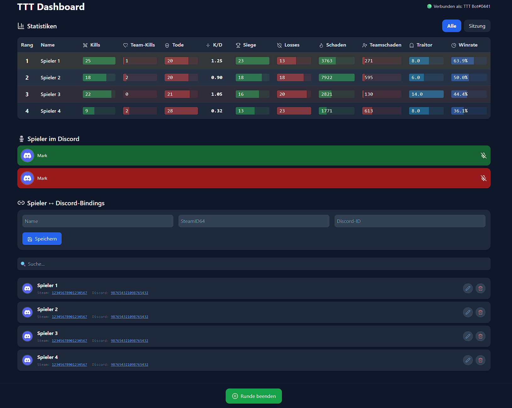

[](https://github.com/Oudstand/TTT-Discord-Bot.git)

# TTT Discord Bot


🎮 Ein Discord-Bot zur automatischen Mute-/Unmute-Steuerung für Trouble in Terrorist Town (Garry's Mod), inkl. Web-Dashboard, Spielerbindungen und Statistiken.

---

## ⚡ Features

- Automatisches Muten/Entmuten der Spieler im Discord-Voice-Channel, basierend auf Spielereignissen.
- Web-Dashboard für den Einblick in Statistiken, Verwaltung der Bindings, Übersicht wer im Discord ist
  - Bindings (SteamID ↔ DiscordID ↔ Name).
  - Statistiken (insgesamt und pro Session):
    - Kills, Team-Kills, Tode, K/D
    - Siege, Niederlagen, Winrate
    - Schaden, Teamschaden, Traitor-Runden
- Statistiken werden zusätzlich am Ende jeder Runde in einem Discord-Kanal gepostet.
- Persistente Speicherung in einer SQLite-Datenbank (via `bun:sqlite`).


*Die Namen, Avatare, SteamIDs und DiscordIDs wurden im Screenshot anonymisiert.*

---

## 🗃️ Datenbank

Dieses Projekt nutzt `bun:sqlite`:

- Datenbank-Datei: `database.sqlite` (wird beim Start automatisch erstellt)
- Tabellen:
  - bindings → SteamID, DiscordID, Name
  - stats → SteamID, Name, Kills, TeamKills, Deaths, Wins, Losses, TraitorRounds, Damage, TeamDamage
  - stats_session → SteamID, Name, Kills, TeamKills, Deaths, Wins, Losses, TraitorRounds, Damage, TeamDamage

---

## ⚙️ Setup & Installation

### 1. Voraussetzungen

- **Bun:** Lade Bun herunter und installiere es von der [offiziellen Webseite](https://bun.sh/).
- **Garry's Mod** mit **Trouble in Terrorist Town**.

### 2. Projekt herunterladen

Lade den Code herunter oder klone das Repository:
```bash
git clone [https://github.com/Oudstand/TTT-Discord-Bot.git](https://github.com/Oudstand/TTT-Discord-Bot.git)
cd TTT-Discord-Bot
````

### 3. Discord Bot

- Erstellen einen Bot in dem [Discord Developer Portal](https://discord.com/developers/applications)
- Zum Server hinzufügen:
  - Auf den Reiter `OAuth2` wechseln.
  - Dort unter `OAuth2 URL Generator` unter `SCOPES` `bot` auswählen.
  - Anschließend unter `BOT PERMISSIONS` `Send Messages` und `Mute Members` auswählen.
  - Mit dem unten stehenden Link den Bot zum Server hinzufügen.
- Kopiere die .env.example-Datei zu .env und fülle die Werte aus:
  - `DISCORD_TOKEN`: Der Token deines Bots
  - `GUILD_ID`: Die ID deines Discord-Servers
  - `COMMAND_CHANNEL_ID`: ID des Kanals für den Mute-Button
  - `STATS_CHANNEL_ID`: ID des Kanals für die Statistik-Nachrichten
  
### 4. Lokales Netzwerk für GMod einrichten (nur Windows)
Damit Garry's Mod mit dem Bot kommunizieren kann, muss eine spezielle Loopback-Adresse eingerichtet werden.
1. **IP hinzufügen:** Öffne eine Eingabeaufforderung als Administrator und führe aus:
  ```bash
  netsh interface ipv4 add address "Loopback Pseudo-Interface 1" 192.178.0.1 255.255.255.255
  ```
2. **Hosts-Datei bearbeiten:** Füge die folgende Zeile am Ende deiner Hosts-Datei (`C:\Windows\System32\drivers\etc\hosts`) hinzu:
  ```bash 
  192.178.0.1    ttthost
  ```

### 5. GMod Addon installieren
Verschiebe die Datei `lua/autorun/server/discord_bot.lua` in deinen GMod-Serverordner: `<pfad-zu-steam>\steamapps\common\GarrysMod\garrysmod\lua\autorun\server`.

### 6. Abhängigkeiten installieren
Führe im Projektordner folgenden Befehl aus:
  ```bash
  bun install
  ```

---

## 🔥 Ausführen

### Bot starten
Führe im Projektordner aus:

```bash
bun start
```

Das Dashboard ist dann unter http://localhost:3000 erreichbar.


### Standalone .exe erstellen
Du kannst eine einzelne, portable `.exe`-Datei erstellen, die keine weiteren Dateien benötigt (außer der `.env`-Datei).
1. **Bauen:**
  ```bash
  bun run build
  ```
2. **Ausführen:**
- Nimm die erstellte `TTT Discord Bot.exe`.
- Lege deine `.env`-Datei in denselben Ordner.
- Starte die `.exe`.